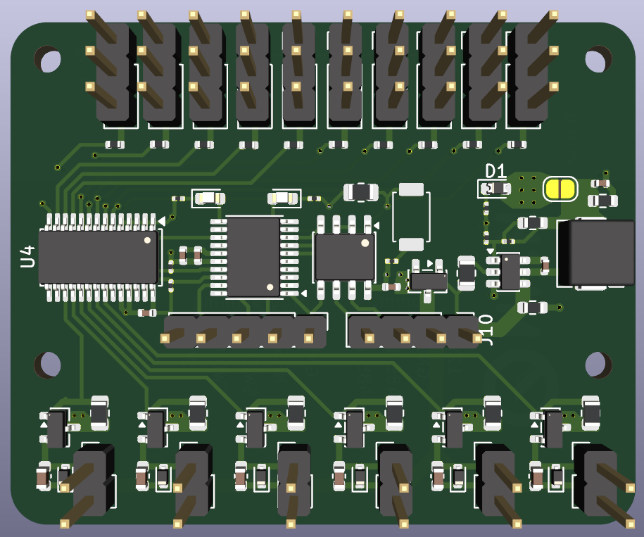
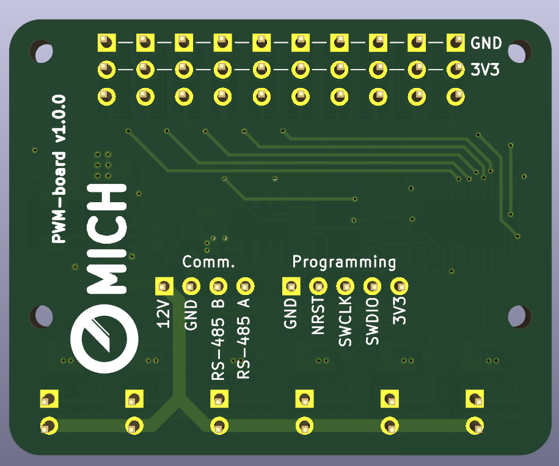
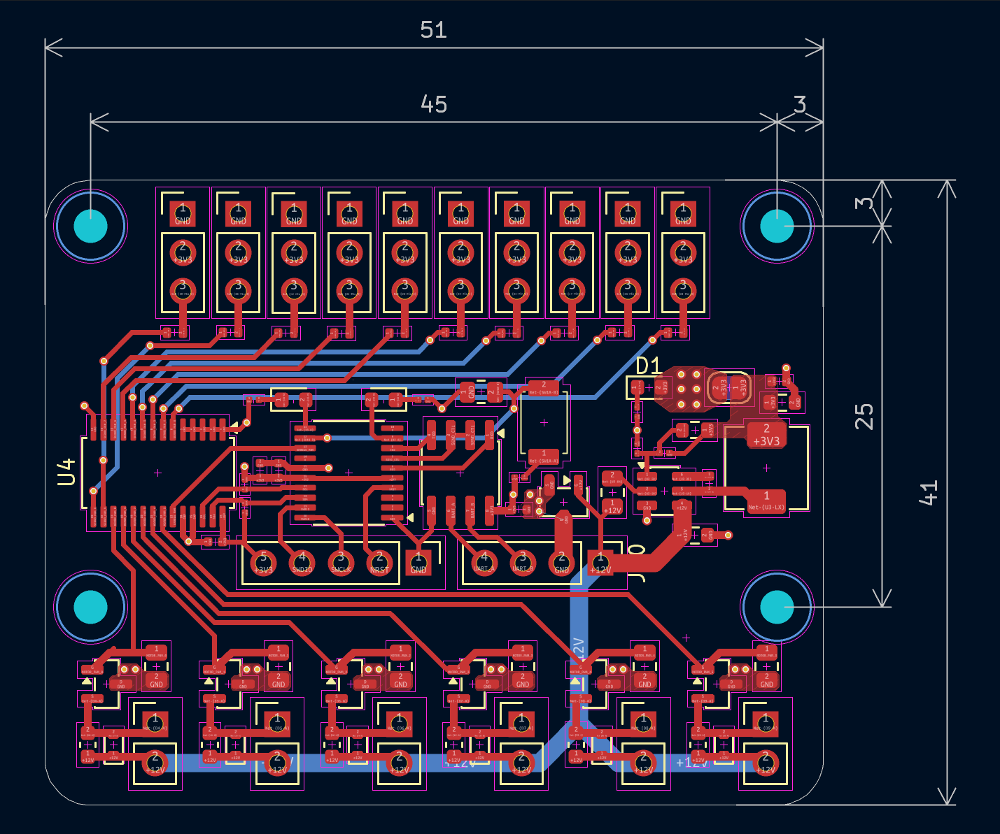

# PWM Board v1.0.0 – User Guide

## Overview

The **PWM Board** is a 16‑channel PWM controller board designed for driving servos, LEDs, or small DC motors. It is built around the **PCA9685** 16‑channel 12‑bit PWM driver, controlled by an **STM32L010F4P6** Arm® Cortex®‑M0+ MCU. Communication is via **RS‑485** (using a SP3485 transceiver), making it suitable for remote or industrial applications. The board also features six low‑side N‑MOSFET outputs (with flyback diodes) for higher‑current loads such as motors or solenoids, and a dedicated 3.3 V buck converter (SY81051) that generates the logic supply from a 12 V input.

## Features

- **16 independent PWM channels** (12‑bit resolution) – 10 are brought out to 3‑pin headers (signal, 3.3 V, GND) for servos/LEDs, and 6 drive N‑MOSFETs for higher‑current loads.
- **On‑board STM32L010F4P6 MCU** – handles RS‑485 communication and controls the PCA9685.
- **RS‑485 interface** – half‑duplex, with automatic direction control via the MCU’s `SEND_CTL` signal.
- **Low‑side MOSFET outputs** – six N‑channel MOSFETs (SOT‑23) with flyback diodes (SOD‑523) for driving inductive loads (motors, relays, etc.).
- **On‑board 3.3 V regulator** – SY81051 step‑down converter, capable of delivering up to 1.5 A (depending on input voltage and thermal conditions).
- **Programming & debugging** – standard 5‑pin SWD header (J11) for use with ST‑Link or compatible debuggers.
- **User button** – SW1 (tactile switch) connected to PA6 for custom firmware functions.
- **Power and status LEDs**:
  - Red LED (D1) – 3.3 V power indicator.
  - Red LED (D2) and green LED (D3) – general‑purpose, connected to MCU pins PA3 and PA5.
- **Compact size** – 51 mm × 41 mm.

## Specifications

| Parameter              | Value                            |
|------------------------|----------------------------------|
| Input voltage          | 12 V DC (nominal)                |
| Logic voltage          | 3.3 V (on‑board buck converter)  |
| PWM channels           | 16 (12‑bit PCA9685)              |
| Servo/ LED headers     | 10× 3‑pin (J0–J9)                |
| Motor/ MOSFET outputs  | 6× 2‑pin (J12–J17)               |
| Communication          | RS‑485 (half‑duplex)             |
| MCU                    | STM32L010F4P6 (TSSOP‑20)         |
| Programming interface  | SWD (5‑pin, 2.54 mm pitch)       |
| Board dimensions       | 51 mm × 41 mm                    |
| Mounting holes         | 4× M2 (2.2 mm diameter)          |

## Connectors and Pinout

### Power and RS‑485 – J10 (1×04 pin header)

| Pin | Function      | Description                                 |
|-----|---------------|---------------------------------------------|
| 1   | +12V          | Main power input (12 V DC)                  |
| 2   | GND           | Ground                                      |
| 3   | RS‑485 B      | RS‑485 differential line B (inverting)      |
| 4   | RS‑485 A      | RS‑485 differential line A (non‑inverting)  |

### Servo / LED Headers – J0 to J9 (1×03 pin headers)

| Pin | Function      | Description                                               |
|-----|---------------|-----------------------------------------------------------|
| 1   | GND           | Ground                                                    |
| 2   | +3V3          | 3.3 V logic supply (for servos/LEDs, check current limit) |
| 3   | PWM signal    | PWM output from PCA9685 channel 0‑9                       |

*Note:* The 3.3 V supply on these headers is derived from the on‑board regulator. Total current available for external loads depends on the input voltage and regulator capability (max ~5A). For high‑power servos, use an external servo supply and only connect signal and GND.

### Motor / MOSFET Outputs – J12 to J17 (1×02 pin headers)

| Pin | Function      | Description                         |
|-----|---------------|-------------------------------------|
| 1   | OUTn          | Drain of N‑MOSFET (low‑side switch) |
| 2   | +12V          | 12 V supply (shared with input)     |

Each output uses an N‑MOSFET (Q0–Q5) with the source connected to GND through a flyback diode (D4–D9) to +12V. This configuration is suitable for driving inductive loads (e.g., small DC motors, solenoids) with PWM from the PCA9685. The MOSFETs are controlled by PCA9685 channels 10–15 respectively.

### Programming Header – J11 (1×05 pin header, SWD)

| Pin | Function      | Description                                         |
|-----|---------------|-----------------------------------------------------|
| 1   | GND           | Ground                                              |
| 2   | NRST          | MCU reset (optional for debugging)                  |
| 3   | SWCLK         | SWD clock                                           |
| 4   | SWDIO         | SWD data I/O                                        |
| 5   | +3V3          | 3.3 V output (can be used to power the programmer)  |

### User Button – SW1

Momentary push button connected to MCU pin PA6. Pressing the button pulls the pin high.

### LEDs

- **D1 (red)** – 3.3 V power indicator, connected to the 3.3 V rail.
- **D2 (red)** – connected to MCU PA3 (active high).
- **D3 (green)** – connected to MCU PA5 (active high).

## Power

The board accepts a 12 V DC input on J10. An internal buck converter (U3, SY81051) generates 3.3 V for the logic and for the servo/LED headers. The 3.3 V rail is also available on the SWD header and can be used to power an external programmer if needed.

**Important:** The total current drawn from the 3.3 V rail (including MCU, PCA9685, and any loads on the servo headers) must not exceed the regulator’s capability. Under typical conditions, the SY81051 can deliver up to 5 A, but thermal performance and input voltage will affect the actual limit.

## Programming the STM32

The STM32L010F4P6 can be programmed via the SWD interface using any standard Arm debugger (e.g., ST‑Link, J‑Link). Connect your programmer to J11 as follows:

| J11 pin | Programmer connection |
|---------|------------------------|
| 1       | GND                    |
| 3       | SWCLK                  |
| 4       | SWDIO                  |
| 5       | 3.3 V (optional)       |

Pin 2 (NRST) is not strictly required for programming but can be used if your debugger supports it.

The MCU is pre‑programmed with a bootloader or demo firmware? (If none, the user will need to flash their own firmware). The board provides access to all MCU pins for custom development.

## Getting Started

1. **Connect power** – supply 12 V DC to J10 (pins 1 and 2).
2. **Check the red LED D1** – it should light, indicating 3.3 V is present.
3. **Connect RS‑485** – if used, connect a twisted pair to J10 pins 3 and 4.
4. **Attach loads** – for servos/LEDs, connect to J0–J9; for motors, connect to J12–J17.
5. **Program the MCU** (if needed) via J11.
6. **Communicate** – send commands over RS‑485 to control the PWM outputs. The default communication protocol depends on the firmware loaded. (Refer to the firmware documentation for details.)

## Mechanical Dimensions

- Board outline: 51 mm × 41 mm (rectangular with rounded corners).
- Four M2 mounting holes (2.2 mm diameter) in a cub format fo size: 45x25 mm

## Bill of Materials (BOM)

A detailed BOM in CSV format is provided as `pwm_board.csv`. It includes all components with their values, footprints, and JLCPCB part numbers where available.

## License

This project is licensed under the MIT License. The design files (KiCad) and any accompanying software or firmware are provided under the terms of this license. See the `LICENSE` file for details.

---

**Happy building!** For questions or contributions, please open an issue or pull request in the project repository.